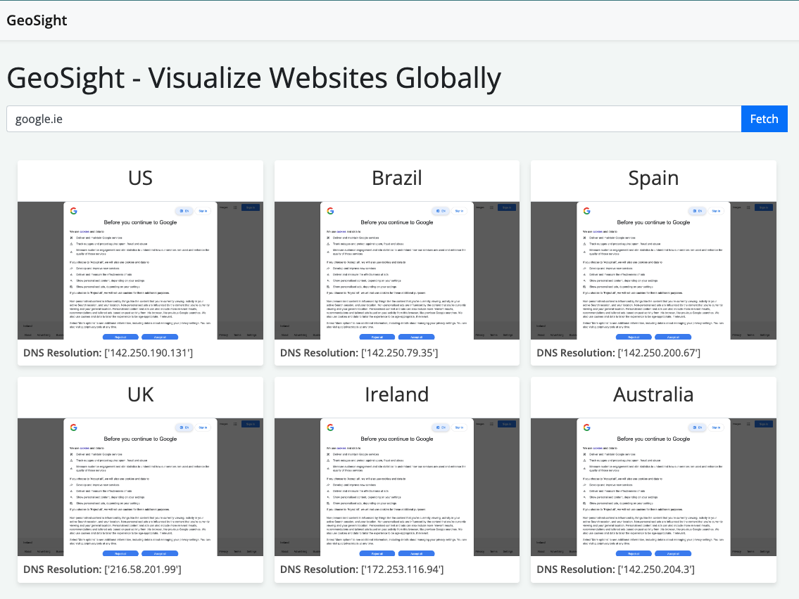

# GeoSight

GeoSight is a Python-based web application designed to help visualize how websites are rendered and resolved in different geolocations. It's particularly useful for testing and verifying DNS-based geolocation strategies, which are often employed for content delivery and regional restrictions.

## Features

- **Geolocational DNS Resolution:** GeoSight can perform DNS lookups from various geographic locations to determine how a domain is resolved in different parts of the world.
- **Webpage Screenshot Capture:** For each geolocation, GeoSight captures a screenshot of the website as it appears when accessed from that region.
- **No Proxy Required and Private URL Handling:** GeoSight uniquely operates without the need for proxies or VPNs. Instead, it utilizes public DNS servers corresponding to various geolocations to resolve domain names. This DNS-based approach enables GeoSight to not only resolve publicly accessible URLs but also handle private or non-publically-addressable URLs.
- **Easy to Use Interface:** A simple web interface where users can input a URL and quickly get visualization results for multiple regions.

## Installation

To set up GeoSight, you'll need Python installed on your system. The application also depends on Playwright for Python, which is used for browser automation to capture screenshots.

1. Clone the repository and move to the directory:
   - `git clone https://github.com/your-username/GeoSight.git`
   - `cd GeoSight`

2. Install the dependencies:
   - `pip3 install -r requirements.txt`
   - `playwright install`

## Usage

To run GeoSight, execute `python3 app.py` in your terminal. Open your web browser and navigate to `http://localhost:5001`. Enter a website URL to see how it is resolved and rendered in different geographic locations.

## Docker (Experimental)

```bash
docker build -t geosight .
docker run -p 5001:5001 geosight
```


## Screenshot



## Configuration

GeoSight uses a configuration file (`geo_config.py`) to define DNS servers for different geographic locations. You can edit this file to add or modify locations and their corresponding DNS servers.

## Contributing

Contributions to GeoSight are welcome! Whether it's adding new features, fixing bugs, or improving documentation, your help is appreciated.

To contribute:
1. Fork the repository.
2. Create a new branch (`git checkout -b feature-branch`).
3. Make your changes and commit them (`git commit -am 'Add a new feature'`).
4. Push to the branch (`git push origin feature-branch`).
5. Create a new Pull Request.

## License

GeoSight is open-source software licensed under the MIT License.

---

**Note:** GeoSight is a tool for educational and testing purposes. Please use it responsibly and in accordance with website owners' terms of service.
